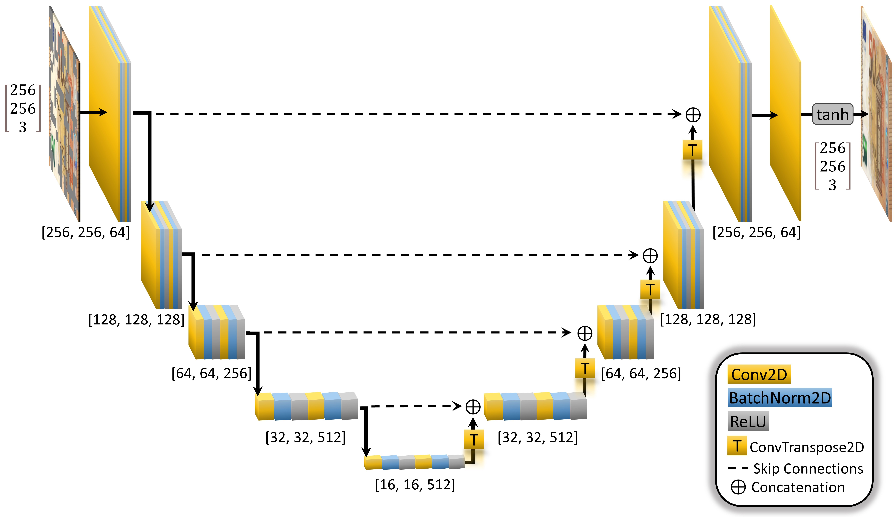

# Anomaly detection on banknote images using RIAD

(work in progress)

An application of the paper [Reconstruction by inpainting for visual anomaly detection](http://www.sciencedirect.com/science/article/pii/S0031320320305094) (RIAD) in PyTorch.

## RIAD Architecture

## U-Net Architecture

## Results Sample
 

## References
Vitjan Zavrtanik, Matej Kristan, Danijel Skčaj, 
Reconstruction by inpainting for visual anomaly detection, 
Pattern Recognition, 
2020, 
107706, 
ISSN 0031-3203 
